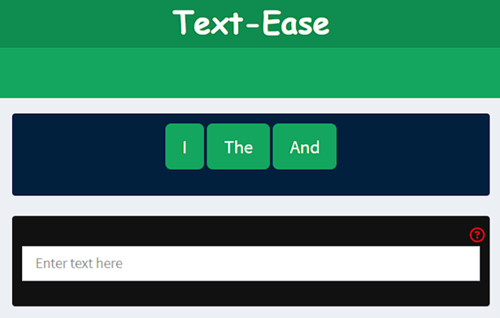

```{css, echo = FALSE}
h1 {
    color: darkslateblue
}

h2,h3,h4,h5,h6 {
    color: steelblue
}
```

## **Introduction**

`Text-Ease` is an app which suggests 3 words that can follow the text entered by the user.

The model behind the app was built on the data from 3 internet sources - **twitter, blogs, and news.**

The model uses **likelihood of the next word and maximizes it by patterns learned from the above data set** and **displays the top 3 words which can follow the last 3 words from the text entered by the user**.  
  
**Salient Features of the App**
  
1. The app provides **suggestions and allows the user to click any suggestion they want and update their input text**, **OR** Gives them the **option to keep typing and the model will keep suggesting words**
2. The app also **takes into consideration sentence end tokens** like `.`,`?`, or `!` and changes the suggested words accordingly
3. The model behind the app **makes sure 3 predictions are always provided** even if the entered word does not occur in the training set.
  
## **Model Summary**

1.  The data was cleaned and then **divided into sentences.**
2.  A random sample of **1 million sentences** was used as the training data.
3.  These sentences were divided into **4 word tokens(quadgrams)** and were **One-Hot Encoded(each unique word was given a unique number)** to conserve memory usage
4.  **Techniques to deal with unknown data**
    -   **Unknown Tokens introduced** - Any words occurring just once in the training set were replaced with `<unk>` placeholder to represent unseen words
    -   **Modified Kneser-Ney Smoothing** - The counts and probability were adjusted according to the modified Kneser-Ney smoothing recommended by [Chen & Goodman, 1995](https://dash.harvard.edu/bitstream/handle/1/25104739/tr-10-98.pdf)
5. **Get top 3 choices for each of the following combinations**
    - 3 word tokens
    - 2 word tokens (in case 3 word tokens do not match with the input text)
    - 1 word tokens with 1 skipped word context (in case 2 word tokens do not match)
    - 1 word tokens with 2 skipped word context (in case no matches found above)
    - 1 word tokens with no context (in case no matches found above)
6. **Different tables were saved to be used by the app to predict the next word**, thus **ensuring minimal calculations done on the app server**

## **Model Metrics**

```{r metrics, cache=TRUE, echo=FALSE, message=FALSE, warning=FALSE, fig.height=3.75, fig.width=7.25}

library(ggplot2)
library(dplyr)
library(cowplot)
library(gt)

# Load the different model metrics csv file
metrics <- read.csv("mkn_metrics.csv", header = TRUE)

# Defining fig A which shows perplexity of different models at different
# sample sizes
figA <- ggplot(metrics[3:8,], aes(sample_size/10^5, perplexity)) +
    geom_point(color = "blue") +
    geom_path(color = "blue") +
    labs(x = "Training Sample Size(in 100k)", y = "Perplexity/quadgram") +
    theme_bw()

# Defining fig B which shows accuracy at different sample sizes
figB <- ggplot(metrics[3:8,], aes(sample_size/10^5, accuracy*100)) +
    geom_point(color = "darkgreen") +
    geom_path(color = "darkgreen") +
    labs(x = "Training Sample Size(in 100k)", y = "Accuracy (in %)") +
    theme_bw()

# Combine the 2 plots
figure <- plot_grid(figA, figB, nrow = 1) +
    labs(title = "Validation Set Metrics (2500 sentences)") +
    theme_bw()
print(figure)
```

```{r final_model_metrics, cache=TRUE, echo=FALSE, message=FALSE, warning=FALSE}

# Load in the final model metrics data
final_metrics <- read.csv("final_model_metrics.csv")

# Cleaning up certain columns
final_metrics$model <- "Modified Kneser-Ney backoff model"
final_metrics$sample_size <- "1 million sentences"
final_metrics$accuracy <- round(final_metrics$accuracy*100, 2)

# Displaying the table for final model metrics
table1 <- gt(final_metrics) %>%
    tab_header(
        title = "",
        subtitle = md("*On the test data set (2500 sentences)*")
    ) %>%
    cols_label(
        model = md("**Final Model**"),
        sample_size = md("**Training Sample Size**  *(sentences)*"),
        vocab_size = md("**Vocabulary Size**"),
        cross_entropy = md("**Loss**  *(per n-gram)*"),
        perplexity = md("**Perplexity**  *(per n-gram)*"),
        accuracy = md("**Accuracy**  *(%)*")
    ) %>%
    tab_style(
        style = cell_text(weight = "bold"),
        locations = cells_body(columns = matches("model"),
                               rows = everything())
    ) %>%
    tab_style(
        style = cell_borders(sides = "all", style = "solid"),
        locations = list(cells_body(columns = everything(), row = everything()),
                      cells_column_labels(columns = everything()))
    ) %>%
    tab_options(table.width = pct(80),
                table.align = "left")

table1

```

## **Glimpse of the app**

+--------------------------------------------------------------------------------+--------------------------------------------------------------------------------------------------------+
|  | **How to use the app?**                                                                                |
|                                                                                |                                                                                                        |
|                                                                                | 1.  **Type in the black box**                                                                          |
|                                                                                | 2.  **Three words will be suggested in the navy blue** box above the black box                         |
|                                                                                | 3.  You can **click on any of the suggested words and the black box will be updated accordingly** *OR* |
|                                                                                | 4.  You can **keep typing and the suggestions will change accordingly.**                               |
+--------------------------------------------------------------------------------+--------------------------------------------------------------------------------------------------------+
  
<style>
div.blue { background-color:#e6f0ff; border-radius: 5px; padding: 20px;}
</style>
<div class = "blue">

**Link to the app** - [Text-Ease](http://akashmer.shinyapps.io/text_ease)
  
**Link to the github repository with all the code** - [Text-Ease Github](https://github.com/AkashMer/text_ease)
  
**License of the app and code** - [MIT License](https://github.com/AkashMer/text_ease/blob/main/LICENSE.md)

</div>
